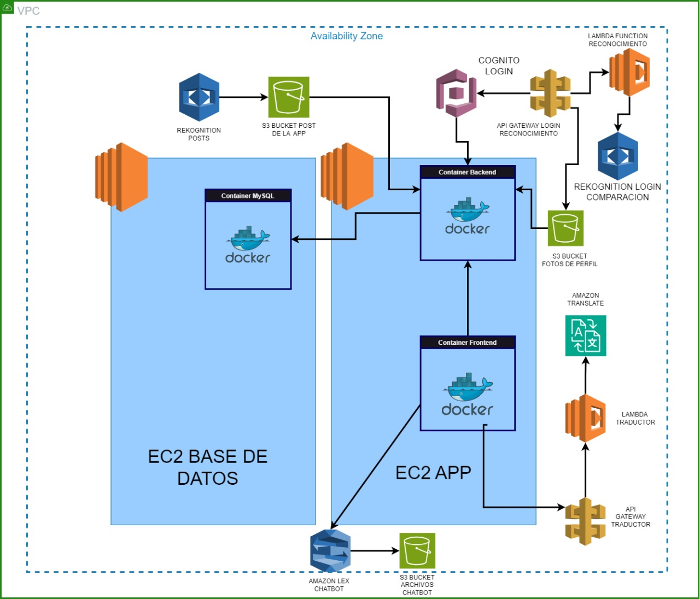
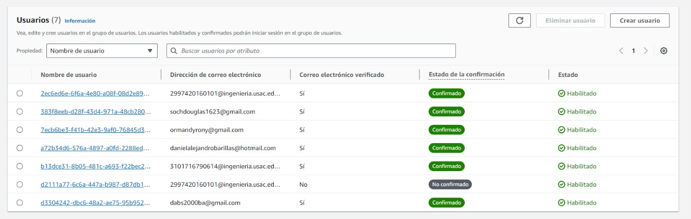

# Semi1-Grupo2-Proyecto2

## **Proyecto 2 SemiSocial**

### Objetivos

- **General**
    - Implementar los servicios de seguridad y desarrollo de AWS
- **Específicos**
    - Crear un entorno de desarrollo para una aplicación web
    - Implementar una arquitectura personalizada
    - Integrar servicios y APIs de AWS

### Descripción

Amazon Web Services (AWS) es una plataforma de servicios de nube que ofrece potencia de cómputo, almacenamiento de bases de datos, entrega de contenido y otra funcionalidad para ayudar a las empresas a escalar y crecer.

Se desarrollará una aplicación web inspirada en diferentes redes sociales, esta permitirá compartir publicaciones a los usuarios registrados. Tendrá las funcionalidades de login, registro de usuarios, ver publicaciones, crear publicaciones, comentarios, chatear con amigos y bots, así como la traducción de publicaciones.

Los servicios de AWS que se utilizarán para este proyecto son:

- IAM
- EC2
- Docker
- S3
- Cognito
- Translate
- Rekognition
- Lambda
- API Gateway

### Sitio web

A continuación, se describen las secciones que contendrá el sitio web:

### **Login**

Para la autenticación se realizará por medio de las credenciales: nombre de usuario y contraseña o por medio de reconocimiento facial haciendo uso de Rekognition y la foto de perfil del usuario. Esta sección deberá ser implementada haciendo uso de Cognito.

### **Registro**

Para registrar un nuevo usuario obligatoriamente se pedirán los datos:

- Nombre completo
- Correo electrónico
- DPI
- Contraseña
- Repetir contraseña

La foto del usuario será obligatoria, esta se realizará eligiendo una imagen de la computadora o tomando una foto con la webcam, ya que esta servirá para el inicio de sesión haciendo uso de Rekognition. Esta sección deberá ser implementada haciendo uso de Cognito.

### **Página principal**

### Ver publicaciones

Se muestran todas las publicaciones que otros usuarios (solo amigos) han realizado, también se muestran las del propio usuario. Todas se muestran ordenadas por fecha de publicación de forma descendente (del más reciente al más antiguo).

### Comentarios

Cada publicación puede recibir comentarios de amigos.

### Filtrar publicaciones

Se tendrá una lista de filtros, estas estarán basadas en las etiquetas de las imágenes de las publicaciones obtenidas por la API de Amazon Rekognition.

El filtro “Todos” siempre aparecerá, los demás dependerán de las imágenes. Al seleccionar una de estas sólo se mostrarán las publicaciones que tienen esa etiqueta.

Además se debe contar con un buscador de etiquetas, donde se puede ingresar el nombre que se desea buscar.

### Crear publicaciones

Se tendrá una sección donde se creará una nueva publicación, la publicación tendrá:

- Imagen (obligatorio)
- Descripción (opcional)

### Traducir publicaciones

La descripción y los comentarios de las publicaciones tendrán la opción de “traducir”, al realizar esta acción deberá de tener 3 idiomas disponibles además del español utilizando la *API de Amazon Translate*

### **Perfil**

### Información del usuario

En esta sección, el usuario puede ver y modificar sus datos, tales como:

- Nombre completo
- DPI
- Foto de perfil
- Se debe ingresar la contraseña correcta para que se guarden los datos modificados.

### **Usuarios y amigos**

Para visualizar a los otros usuarios registrados, se debe de mostrar un apartado donde se lista a los usuarios que no son amigos. Los usuarios que son amigos solo se mostrarán en el Chat, que se describe más adelante.

La forma para agregar amigos será de la manera que funciona Facebook por lo que se deberán manejar solicitudes de amistad con la posibilidad de aceptar o rechazar.

### **Chat**

En esta sección, el usuario puede comunicarse con sus amigos.

### Chat con amigos

Ambos usuarios amigos pueden enviar y recibir mensajes. Se recomienda utilizar sockets para la comunicación en tiempo real.

### Bot

Para el chatbot se debe utilizar Amazon Lex. El funcionamiento del chatbot deberá ser sobre la facultad de ingeniería (preguntas frecuentes, horarios de cursos, redes de estudio), se valorará la funcionalidad creativa del chatbot y que pueda tener funciones más allá de responder con texto predeterminado.

### **Implementación**

Los servicios deben de ser implementados utilizando contenedores Docker. Se utilizarán 3 contenedores de Docker (según la implementación), uno para la aplicación web y servidor, y otro para la base de datos, se debe de utilizar **docker-compose** para levantar y dar de baja (up y down respectivamente) el entorno creado.

### **Instancias EC2**

Se deben de configurar 2 instancias EC2 para alojar los siguientes servicios.

- En una instancia debe estar solo la base de datos.
- Para el servidor y el sitio web se deben implementar en una misma instancia.

Tomar en cuenta la seguridad de las instancias EC2 y la implementación con docker-compose.

### **Imágenes en S3**

Se debe configurar un bucket de S3 que contenga de nombre **semi1proyecto-g#**, para el almacenamiento de imágenes, tales como las de las publicaciones y las fotos de perfil de los usuarios.

### **Cognito**

En este servicio se debe de configurar un pool de usuarios, de tal forma que cada usuario registrado y que actualice sus datos en la aplicación también se almacene en este pool, la forma de hacer la relación entre este pool de usuarios y los datos a guardar en la BD queda a criterio de los estudiantes. Se debe de tener como mínimo los siguientes datos:

- Nombre Completo
- Correo electrónico
- DPI
- Contraseña encriptada

Estos datos también deben de actualizarse cuando el usuario modifique sus datos desde la aplicación. Es necesario implementar la verificación por correo electrónico utilizando Cognito.

### **Rekognition**

Se utilizará para obtener una lista de etiquetas de las imágenes que se publican, que se utilizarán para realizar los filtros de publicaciones y para el login de la aplicación por medio de reconocimiento facial.

### **Translate**

Se utilizará para traducir el texto de las publicaciones en cualquier idioma al español o viceversa.

### **API Gateway y Función Lambda**

Se debe de implementar una API y una función lambda que se utilizará para alguna de las funcionalidades del proyecto, esta queda a criterio del estudiante.

### **Seguridad**

Deben de configurarse correctamente los security groups y los permisos que se le asignen a los usuarios IAM.

Los endpoints de su servidor backend debe estar seguro, para ello se utilizará JWT.

### Describir la arquitectura implementada.

1. **VPC (Virtual Private Cloud)**: Es el contorno que encapsula toda la infraestructura, proporcionando un entorno de red aislado.

2. **Zonas de Disponibilidad**: Dentro del VPC, la infraestructura parece distribuida en diferentes zonas de disponibilidad para garantizar alta disponibilidad y resistencia a fallos.

3. **REKOGNITION POSTS y REKOGNITION LOGIN COMPARACION**: Son servicios de AWS Rekognition que probablemente se utilicen para el reconocimiento de imágenes y comparación facial.

4. **S3 BUCKET POST DE LA APP y S3 BUCKET FOTOS DE PERFIL**: Estos son almacenamientos en Amazon S3 donde se guardan publicaciones y fotos de perfil respectivamente.

5. **EC2 BASE DE DATOS**: Representa una instancia EC2 en la que se está ejecutando una base de datos. Esta base de datos parece estar dentro de un contenedor Docker etiquetado como "Container MySQL".

6. **EC2 APP**: Representa una instancia EC2 que aloja la aplicación. Dentro de esta instancia, hay dos contenedores Docker: uno para el backend y otro para el frontend.

7. **COGNITO LOGIN**: Es el servicio AWS Cognito utilizado para la autenticación y el inicio de sesión.

8. **API GATEWAY LOGIN RECONOCIMIENTO y API GATEWAY TRADUCTOR**: Estos son puntos de entrada de la API que gestionan el reconocimiento de inicio de sesión y la traducción, respectivamente.

9. **LAMBDA FUNCTION RECONCOMINTO, LAMBDA TRADUCTOR**: Son funciones sin servidor que se activan en respuesta a eventos. Estas funciones gestionan tareas específicas como el reconocimiento y la traducción.

10. **AMAZON TRANSLATE**: Es el servicio AWS que proporciona capacidades de traducción.

11. **AMAZON LEX CHATBOT**: Es un servicio para la creación de chatbots, lo que sugiere que hay una funcionalidad de chatbot integrada en la aplicación.

### Describir los usuarios IAM, permisos y roles utilizados para la elaboración del proyecto.

